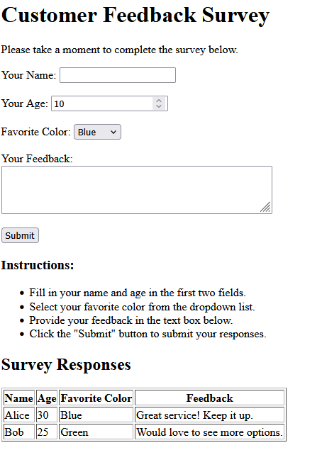

# Customer Feedback Survey

## Description

Customer Feedback Survey is a simple HTML-based web form that allows users to provide their basic information and feedback.

The form collects the user's name, age, favorite color, and feedback. It also includes instructions and a table displaying sample survey responses.

## Features

- Takes the user's name
- Takes the user's age
- Provides a favorite color dropdown
- Allows users to enter feedback
- Uses required form fields
- Displays survey instructions
- Displays sample survey responses in a table

## Technologies Used

- HTML5
- Visual Studio Code

## HTML Concepts Used

- HTML structure
- Headings
- Paragraphs
- Forms
- Labels
- Text input
- Number input
- Select and option
- Textarea
- Submit button
- Unordered lists
- Tables
- Table rows and columns
- Required fields
- Input validation using `min` and `max`

## How to Run

1. Open Visual Studio Code.
2. Open the `Survey_System` project folder.
3. Open `online_survey_system.html`.
4. Save the file.
5. Open the HTML file in a web browser.

You can also use the Live Server extension in VS Code.

## Project Structure

Survey_System/
│
├── online_survey_system.html
├── customer_feedback.png
└── README.md

## Output

The following image shows the output of the Customer Feedback Survey webpage.

## Future Improvements

- Add CSS styling
- Make the webpage responsive
- Add JavaScript form validation
- Display submitted responses dynamically
- Store responses using a backend
- Add a database
- Add edit and delete options for responses

## Author

**Uma Naga Srinivas**

B.Tech - Artificial Intelligence & Machine Learning